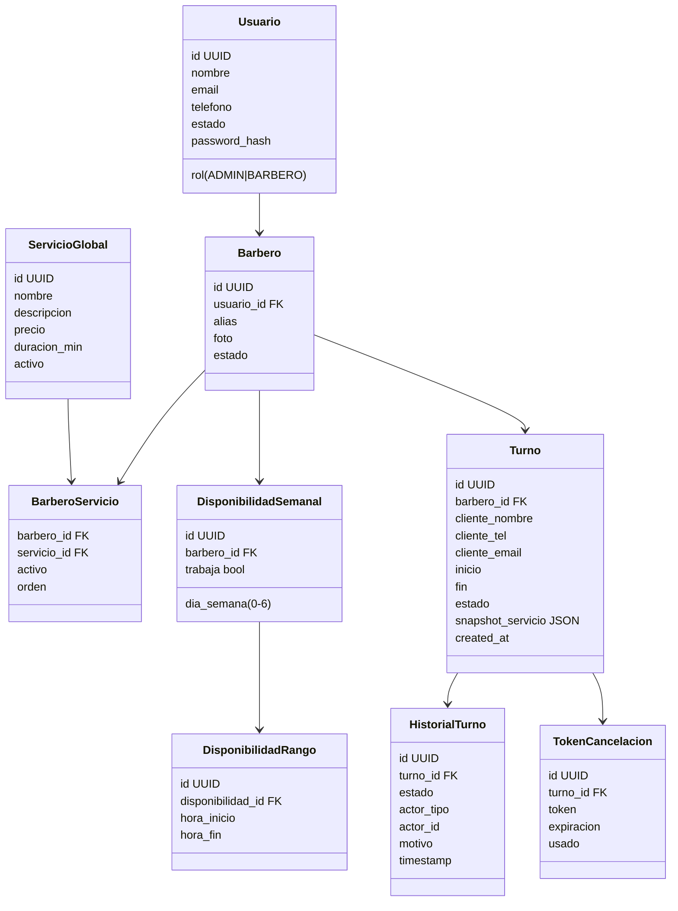

# Planificación Integral — Sistema Web "Agenda de Barbería"

## A) Visión, alcance y supuestos
**Visión:** sistema web mobile-first que permite a clientes invitados reservar y cancelar turnos sin registrarse, mientras admin/barberos gestionan agenda, disponibilidad y catálogo global de servicios con trazabilidad completa.

**Alcance IN:**
- Gestión de barberos (ABM con baja lógica y activación/desactivación).
- Catálogo global de servicios con duración mínima 30 min y orden personal por barbero.
- Agenda por barbero con validación anti-superposición atómica.
- Disponibilidad semanal con rangos por día, múltiples tramos por día y opción de no trabajar.
- Reserva/cancelación de clientes invitados (sin cuenta) con CAPTCHA y confirmación vía WhatsApp.
- Historial/auditoría de turnos y acciones (snapshot de servicio en el momento de reservar).
- Notificaciones (conceptual) principalmente vía WhatsApp.
- Seguridad básica (CSRF/XSS, rate limiting, validación server-side) y control de accesos por rol.

**Alcance OUT:**
- Pagos en línea, depósitos o facturación.
- App nativa; solo web ultra responsive.
- Integraciones con sistemas externos de facturación o CRM.
- Gestión de stock o venta de productos.

**Supuestos:**
- Zona horaria fija: America/Montevideo almacenada en UTC en DB con conversión en UI. (Asunción)
- WhatsApp vía WhatsApp Business Cloud API/Twilio con mensajes de plantilla y enlaces con tokens firmados. (Asunción)
- CAPTCHA: reCAPTCHA v2/v3 o hCaptcha; backend valida token. (Asunción)
- Retención de datos: 24 meses para datos de contacto de clientes invitados; logs/auditoría se conservan 36 meses. (Asunción)
- Slot base agenda: 15 minutos para granularidad fina; las duraciones de servicios son múltiplos de 15 y mínimo 30. (Asunción)

## B) Épicas y user stories
1. **Gestión de barberos**
   - Como *Administrador* quiero crear/editar/desactivar barberos para mantener el staff actualizado.
   - Como *Administrador* quiero listar barberos con su estado para controlar disponibilidad operativa.

2. **Catálogo de servicios global**
   - Como *Administrador* quiero crear/editar servicios globales (>=30 min) para definir la oferta estándar.
   - Como *Barbero* quiero habilitar/deshabilitar y reordenar servicios globales para reflejar lo que ofrezco.

3. **Disponibilidad y agenda**
   - Como *Barbero* quiero configurar mi disponibilidad semanal con tramos por día para evitar reservas fuera de horario.
   - Como *Barbero* quiero ver mi agenda diaria/semana sin superposiciones para organizar mi trabajo.

4. **Reserva de cliente invitado**
   - Como *Cliente invitado* quiero reservar un turno sin registrarme para agendar rápidamente.
   - Como *Cliente invitado* quiero cancelar mi turno mediante un enlace/token para liberar el horario si no puedo asistir.

5. **Historial y auditoría**
   - Como *Administrador* quiero ver el historial de acciones de cada turno para asegurar trazabilidad.
   - Como *Barbero* quiero ver el snapshot del servicio del turno para honrar las condiciones acordadas.

6. **Notificaciones y anti-spam**
   - Como *Cliente invitado* quiero recibir confirmación por WhatsApp para tener certeza de la reserva.
   - Como *Administrador* quiero proteger el formulario con CAPTCHA y rate limiting para evitar spam.

## C) Backlog priorizado (MoSCoW) + criterios de aceptación
**Must**
1. Crear/editar/desactivar barberos (Admin).
   - CA: Alta con campos obligatorios; desactivación impide nuevas reservas al barbero; listado muestra estado.
2. Catálogo de servicios global con duración >=30 y múltiplos de 15.
   - CA: Validación server-side; cambios no afectan snapshots ya guardados.
3. Configuración de disponibilidad con tramos por día y opción "no trabajo".
   - CA: UI permite añadir/remover tramos; backend valida solapamientos en disponibilidad.
4. Reserva de invitado: elegir barbero -> servicio habilitado -> fecha/hora disponible -> datos cliente -> CAPTCHA -> confirmación.
   - CA: Slots generados desde disponibilidad y sin superposición; datos validados; se guarda snapshot de servicio.
5. Cancelación de turno: cliente (vía link WhatsApp) o admin/barbero con motivo opcional.
   - CA: Estado cambia a Cancelado con registro en historial; slot liberado.
6. Historial de acciones y snapshot inmutable por turno.
   - CA: Registro de actor, timestamp, motivo/estado; no se borra.
7. Autenticación para Admin/Barbero; control de acceso por rol.
   - CA: Áreas protegidas; cliente solo público.
8. Seguridad básica: CSRF/XSS, rate limiting reservas, validación backend.
   - CA: Tokens CSRF en formularios autenticados; inputs saneados; rate limit IP para reservas.

**Should**
9. Notificaciones WhatsApp para confirmación y cancelación.
   - CA: Mensaje enviado tras crear/cancelar; si falla se registra intento.
10. Orden personal de servicios por barbero.
   - CA: Barbero define orden; UI respeta orden.

**Could**
11. Vista semanal/diaria compacta en panel barbero con filtros.
12. Estadísticas básicas (turnos por día, cancelaciones).

**Won't (por ahora)**
13. Pagos, depósitos, programa de puntos.

## D) Modelo de dominio (texto + Mermaid)
**Entidades clave**
- **Usuario** (Admin/Barbero): id, rol, nombre, email, teléfono, estado, credenciales hash, timestamps.
- **Barbero**: id, usuario_id (FK), alias, foto (opcional), estado (activo/inactivo), contacto.
- **ServicioGlobal**: id, nombre, descripción, precio, duración_min (>=30 y múltiplo de 15), activo.
- **BarberoServicio**: barbero_id, servicio_id, activo, orden.
- **DisponibilidadSemanal**: barbero_id, día_semana, activo (trabaja/no), tramos [lista de rangos].
- **Turno**: id, barbero_id, cliente_nombre, cliente_tel, cliente_email, fecha_hora_inicio, fecha_hora_fin, estado, snapshot_servicio, canal_reserva, created_at.
- **HistorialTurno**: id, turno_id, estado, actor_tipo (admin/barbero/cliente/sistema), actor_id (nullable), motivo, timestamp.
- **TokenCancelación**: id, turno_id, token, expiración, usado, canal (WhatsApp/email), created_at.



## E) Diseño de base de datos (tablas sugeridas)
- **usuarios**(id PK UUID, rol ENUM, nombre, email UNIQUE, telefono, estado ENUM, password_hash, created_at, updated_at).
- **barberos**(id PK UUID, usuario_id FK->usuarios.id UNIQUE, alias, foto_url, estado ENUM, telefono, email, created_at, updated_at, deleted_at NULL).
- **servicios_globales**(id PK UUID, nombre, descripcion, precio NUMERIC(10,2), duracion_min INT CHECK >=30 AND duracion_min % 15 = 0, activo BOOL, created_at, updated_at).
- **barbero_servicios**(barbero_id FK, servicio_id FK, activo BOOL, orden INT, PRIMARY KEY(barbero_id, servicio_id)). Índice por (barbero_id, activo, orden).
- **disponibilidades**(id PK UUID, barbero_id FK, dia_semana SMALLINT, trabaja BOOL, created_at, updated_at, UNIQUE(barbero_id, dia_semana)).
- **disponibilidad_rangos**(id PK UUID, disponibilidad_id FK, hora_inicio TIME, hora_fin TIME, CHECK(hora_fin>hora_inicio)). Índice (disponibilidad_id, hora_inicio).
- **turnos**(id PK UUID, barbero_id FK, cliente_nombre, cliente_tel, cliente_email, inicio TIMESTAMP WITH TIME ZONE, fin TIMESTAMP WITH TIME ZONE, estado ENUM, snapshot_servicio JSONB, created_at, updated_at, canal_reserva). Índice único (barbero_id, inicio) + constraint EXCLUDE usando gist para no superponer: EXCLUDE USING gist (barbero_id WITH =, tstzrange(inicio, fin) WITH &&).
- **historial_turnos**(id PK UUID, turno_id FK, estado ENUM, actor_tipo ENUM, actor_id UUID NULL, motivo TEXT, created_at TIMESTAMP WITH TIME ZONE). Índice por turno_id.
- **tokens_cancelacion**(id PK UUID, turno_id FK UNIQUE, token TEXT UNIQUE, expiracion TIMESTAMP WITH TIME ZONE, usado BOOL, created_at). Índice por expiracion para limpiezas.

## F) API/Endpoints (ejemplo REST)
Base path `/api/v1`.

**Auth** (Admins/Barberos)
- POST `/auth/login` -> {email, password} => {token_jwt}
- POST `/auth/logout`

**Barberos (Admin)**
- GET `/barberos`
- POST `/barberos`
- PUT `/barberos/{id}`
- PATCH `/barberos/{id}/estado` (activar/desactivar/baja lógica)

**Servicios globales (Admin)**
- GET `/servicios`
- POST `/servicios`
- PUT `/servicios/{id}`
- PATCH `/servicios/{id}/estado`

**Servicios por barbero (Barbero)**
- GET `/barberos/me/servicios`
- PATCH `/barberos/me/servicios/{servicioId}` (activar/desactivar)
- PATCH `/barberos/me/servicios/orden` (reordenar array de ids)

**Disponibilidad (Barbero)**
- GET `/barberos/me/disponibilidad`
- PUT `/barberos/me/disponibilidad` (lista de días con rangos)

**Agenda/Turnos**
- GET `/barberos/{id}/slots` query: `fecha=YYYY-MM-DD&servicioId` -> lista de horarios disponibles calculados contra disponibilidad y superposición.
- POST `/turnos` -> {barberoId, servicioId, fecha, horaInicio, cliente:{nombre,tel,email}, captchaToken}
- POST `/turnos/{id}/cancelar` (Admin/Barbero) -> {motivo}
- POST `/turnos/{id}/finalizar`
- POST `/turnos/{id}/no-show`

**Cancelación cliente invitado**
- POST `/turnos/cancelar-invitado` -> {token, motivo?}

**Historial**
- GET `/turnos/{id}/historial` (Admin/Barbero propietario)

**Ejemplo response snapshot turno**
```json
{
  "id": "uuid",
  "barberoId": "uuid",
  "estado": "RESERVADO",
  "inicio": "2024-05-10T14:00:00Z",
  "fin": "2024-05-10T14:30:00Z",
  "cliente": {"nombre": "Juan", "tel": "+598...", "email": "a@b.com"},
  "servicio": {"nombre": "Corte clásico", "duracionMin": 30, "precio": 500, "descripcion": "..."}
}
```

## G) Flujos UX
**Cliente invitado (reserva)**
1) Home: CTA "Reservar".
2) Selección de barbero (cards con alias/estado/foto opcional).
3) Selección de servicio (lista habilitada por barbero, con duración/precio).
4) Selección de fecha (calendario) -> lista de horarios disponibles.
5) Formulario datos + CAPTCHA.
6) Confirmación + mostrar resumen + botón “Compartir/WhatsApp”.

**Cliente invitado (cancelación)**
1) Recibe WhatsApp con link/token.
2) Abre pantalla de confirmación (muestra turno y datos de barbero/servicio snapshot).
3) CAPTCHA simple (opcional) + botón cancelar.
4) Muestra confirmación y actualiza estado.

**Barbero**
- Login -> Panel agenda (vista día/semana). Puede cancelar/finalizar/no-show con motivo.
- Gestión disponibilidad (por día, tramos). Validación de solapes.
- Servicios habilitados: toggles + orden.

**Administrador**
- Login -> Dashboard básico.
- ABM Barberos.
- ABM Servicios globales.
- Consulta de agendas y historial.

## H) Wireframe textual (mobile/desktop)
**Home/Reserva**
- Mobile: Header minimal + hero con CTA "Reservar"; cards de barbero en carrusel; botón flotante WhatsApp ayuda.
- Desktop: grid de barberos; panel lateral con resumen de pasos.

**Selección de barbero**
- Mobile: lista scrollable con foto/alias/estado y chip “hoy disponible”.
- Desktop: cards en grilla; filtro por disponibilidad.

**Selección de servicio**
- Mobile: lista con nombre, duración (badge), precio; toggle de info.
- Desktop: tabla simple con columna de duración/precio.

**Calendario/horarios**
- Mobile: calendario mensual compacto; debajo chips de horarios; slots deshabilitados grisados.
- Desktop: calendario + panel lateral con horarios.

**Confirmación**
- Mobile: tarjeta con resumen (barbero, servicio snapshot, fecha/hora, precio), botón confirmar, CAPTCHA, check de aceptación de política de datos.
- Desktop: layout en dos columnas (resumen + formulario datos/CAPTCHA).

**Cancelación invitado**
- Mobile: pantalla con resumen del turno, botón rojo “Confirmar cancelación”, sección “¿Seguro?” con motivo opcional, CAPTCHA opcional.
- Desktop: modal centrado sobre resumen.

**Panel Barbero**
- Mobile: tabs “Agenda”, “Disponibilidad”, “Servicios”. Agenda en lista por día con estados; botón FAB para cambiar estado. Disponibilidad editable con acordeones por día y rangos. Servicios con toggles y drag handle para orden.
- Desktop: layout 2 columnas; agenda con calendario lateral; tablas editables para disponibilidad/servicios.

**Panel Admin**
- Mobile: lista de barberos con acciones rápidas (activar/desactivar); formulario de alta. Tabla simple para servicios globales.
- Desktop: tablas con filtros/búsqueda; modals para alta/edición.

## I) Plan de validaciones
- **Frontend:** campos requeridos, formato email/teléfono, longitud mínima de nombre, límites de rango horario, duración múltiplos de 15, CAPTCHA obligatorio, deshabilitar slots ocupados.
- **Backend:** validar roles/ACL, sanitizar inputs, verificar CAPTCHA con proveedor, constraints de duración (>=30, múltiplo de 15), verificar que el servicio esté habilitado para el barbero, disponibilidad y no-superposición via transacción + constraint EXCLUDE, token de cancelación válido/no expirado/no usado.
- **Mensajes de error:** claros y cortos (“Correo inválido”, “El horario ya fue tomado, elegí otro”, “CAPTCHA inválido”, “Servicio no disponible para este barbero”, “Token de cancelación inválido o expirado”).

## J) Plan de pruebas
- **Unitarias:**
  - Validación de rangos de disponibilidad (sin solapes, hora_fin>hora_inicio).
  - Cálculo de slots disponibles dada disponibilidad + turnos existentes.
  - Máquina de estados: transiciones permitidas.
  - Generación/verificación de token de cancelación.
- **Integración:**
  - Creación de turno guarda snapshot de servicio.
  - Cancelación por barbero/admin registra historial y libera slot.
  - API de slots bloquea solapamientos concurrentes (tests con transacciones simultáneas).
  - Verificación CAPTCHA con mock proveedor.
- **E2E:**
  - Flujo completo de reserva invitado hasta confirmación WhatsApp (simulado).
  - Cancelación vía enlace y cambio de estado.
  - Cambio de disponibilidad impacta en slots ofrecidos.
  - Modificación de servicio global no altera snapshot de turnos pasados.
  - Caso crítico: dos reservas simultáneas mismo slot -> una falla con mensaje claro.

## K) Riesgos y mitigaciones
| Riesgo | Impacto | Mitigación |
| --- | --- | --- |
| Doble reserva simultánea | Alto | Constraint EXCLUDE + transacción serializable/lock por barbero y retry con mensaje claro. |
| Falla en WhatsApp | Medio | Reintentos con backoff, fallback a email opcional, log de fallos. |
| Spam de bots | Medio | CAPTCHA + rate limiting IP + honeypot. |
| Configuración errónea de disponibilidad | Medio | Validaciones de solape y vista previa de agenda. |
| Pérdida de auditoría | Alto | Soft deletes, tablas de historial inmutables, backups diarios. |
| Zona horaria mal aplicada | Medio | Almacenar UTC, convertir a America/Montevideo en UI, tests de tz. |

## L) Roadmap por etapas
- **Semana 1 (MVP foundations):** Setup proyecto, auth básica (Admin/Barbero), modelos DB, ABM servicios globales y barberos (sin fotos), disponibilidad básica.
- **Semana 2 (MVP reservas):** Endpoints de slots, creación de turno con snapshot, validaciones, constraint anti-superposición, UI móvil reserva.
- **Semana 3 (MVP cancelación + auditoría):** Tokens de cancelación, historial de estados, panel barbero agenda mínima, cancelación admin/barbero.
- **Semana 4 (V1 UX y notifs):** WhatsApp integrado (simulado/real), orden de servicios por barbero, mejoras UX responsive, accesibilidad básica, rate limiting.
- **Semana 5 (Hardening):** Tests e2e, manejo de tz, backups/retención, monitoreo de logs, optimizaciones de rendimiento.

## Opciones de stack
1) **Simple/Rápida:**
   - Backend: Node.js + Express, PostgreSQL, JWT, Objection/Knex. Deploy en Railway/Fly.io.
   - Frontend: React + Vite + Tailwind + React Query; despliegue en Vercel. CAPTCHA reCAPTCHA.
2) **Más escalable:**
   - Backend: NestJS o Django Rest Framework; PostgreSQL con constraint EXCLUDE; Redis para rate limiting/locks. Deploy en Kubernetes/Render.
   - Frontend: Next.js (App Router) + Tailwind + TanStack Query. CDN/Edge caching. CAPTCHA hCaptcha.
